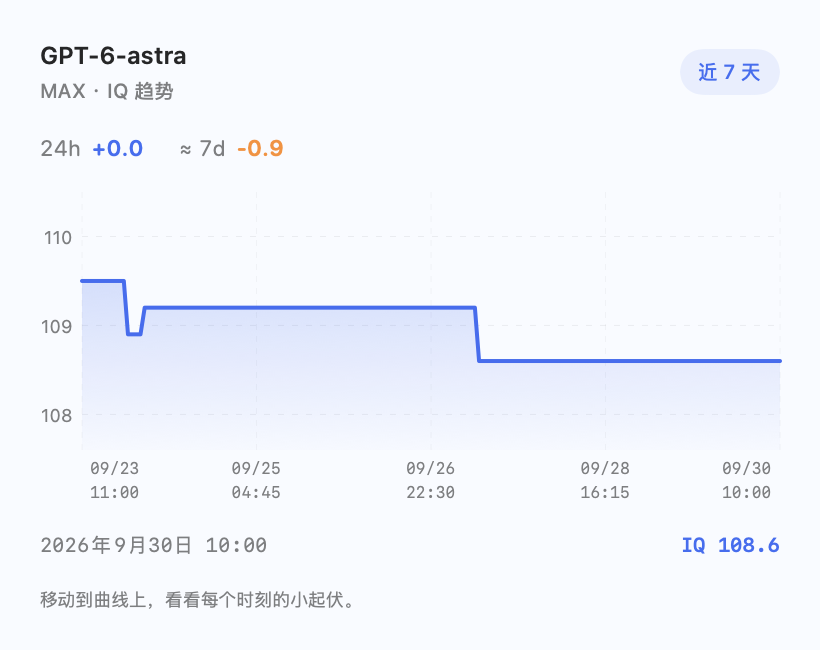

<div align="center">


# AICleverYet

**今天的 AI，聪明点了吗？**

一个安静待在 Mac 菜单栏里的 AI IQ 对比工具。<br>
切换 harness，比较推理档位，悬浮看看分数的小起伏。

  [](LICENSE) 

[界面预览](#preview) · [安装运行](#quick-start) · [轻量安心](#network) · [开发说明](#development)

</div>

## 🧠 为什么做这个？

选好了模型，还得选 `LOW`、`HIGH`、`MAX` 还是 `ULTRA`。

**推理强度拉满，评测分数就一定最高吗？** 与其凭名字猜，不如把同一个模型的各档位摊开来看：IQ、耗时、成本，一行一个。

**AICleverYet** 读取 [Codex Radar](https://codexradar.com) 的公开评测数据。在蓝色卡片栏中切换 Codex、Claude Code、DSH 等 harness，选择模型，再一次看齐它的所有推理档位。菜单栏只留一个小图标，让分数待在需要它的地方。

> ✦ 蓝色高亮给样本足够的最高分，不给名字听起来最厉害的档位。

<a name="preview"></a>

## 👀 看一眼就懂

<table>
  <tr>
    <th>☀️ 浅色</th>
    <th>🌙 深色</th>
  </tr>
  <tr>
    <td></td>
    <td></td>
  </tr>
</table>

*图片由实际 SwiftUI 界面渲染，使用 2026-09-30 的测试样本；不是实时排行榜。*

| 你想知道的 | 打开后能看到的 |
| --- | --- |
| 想换一套工具看看？ | 顶部 harness 卡片切换 Codex、Claude Code、DSH 等；箭头或“全部”可访问更多 |
| 同一个模型，哪个档位分数高？ | 所有推理强度同时列出，最高 IQ 的强度名称与分数一起加粗、以蓝色强调 |
| 更高分要花多少时间和钱？ | 同行展示平均耗时与评测成本 |
| 我常用的档位最近怎么样？ | 悬浮在该行的小曲线图标上，展开 24h／7d 变化与趋势；时间轴有五组日期和时间 |
| 不想菜单栏塞满数字？ | 菜单栏只显示小图标，不显示 IQ |
| 有些档位暂时缺样本？ | 保留对应行并提示“数据不足”；悬停分数处可查看样本量与原始评分 |
| 网络暂时不通？ | 保留上次成功结果，并标注离线快照 |

<a name="quick-start"></a>

## 🚀 三步跑起来

目前提供**源码构建**，无需 API Key，也不用登录 Codex Radar。无需完整 Xcode。

### 1. 准备环境

需要 **macOS 13+** 和 **Swift 5.9+**。在终端检查：

```sh
swift --version
```

如果尚未安装 Apple Command Line Tools：

```sh
xcode-select --install
```

安装完成后再次检查 Swift 版本。若版本过旧，请更新 Command Line Tools。

### 2. 下载并构建

```sh
git clone https://github.com/lcp2021211/AICleverYet.git
cd AICleverYet
./scripts/build.sh
```

构建完成后，应用位于 `dist/AICleverYet.app`。

### 3. 打开菜单栏 App

```sh
open "dist/AICleverYet.app"
```

菜单栏会出现 AICleverYet 的小星光图标。**第一次点击时才获取数据。** 你也可以把生成的 App 拖进“应用程序”目录。

> 找不到 Dock 图标？这是正常的，它住在菜单栏里。🏠

构建产物对应当前 Mac 的处理器架构；Apple Silicon 已做本机验证，Intel 尚未实机验证。脚本执行本机 ad-hoc 签名，未提供 Developer ID 签名或 Apple 公证的安装包。

## 🎛️ 怎么用

1. **选 harness，再选模型**：顶部卡片支持横向滚动、箭头切换和“全部”菜单，各 harness 会记住上次选的模型。
2. **看蓝色行**：同一模型下，样本足够的最高 IQ 档位加粗高亮；耗时和成本就在同一行。
3. **悬浮看趋势**：将鼠标移到该行的小曲线图标，展开趋势浮层。进入曲线继续移动，可读出具体日期、时间与 IQ；也支持点击图标打开。

| 操作 | 方式 |
| --- | --- |
| 获取最新数据 | 右上角刷新按钮，或面板内 `⌘R` |
| 收起面板 | 点击外部、再点菜单栏图标，或按 `Esc` |
| 退出 App | 右下角“退出”，或面板内 `⌘Q` |

首次使用从数据源首个模型开始。切换 harness 时会恢复此前选择；每个模型的最高分强调随数据更新。当前已覆盖 Codex、Claude Code、DSH、Kimi Code、ZCode、Grok、Antigravity、CodeBuddy、Kiro；卡片按实际返回数据出现，未知分组放入“其他”。

<a name="network"></a>

## 🍃 你不点它，它就不联网

SwiftUI + AppKit + 系统 Charts。没有浏览器内核，没有第三方运行时，没有后台轮询。

| 场景 | 行为 |
| --- | --- |
| 启动 App / 待在后台 / 从睡眠唤醒 | 不请求数据 |
| 打开面板 | 先显示缓存，仅请求过期的数据 |
| 短时间内反复打开 | 当前数据缓存 **60 秒**，历史数据缓存 **15 分钟** |
| 切换 harness、模型，或悬浮看趋势 | 本地切换，不追加网络请求 |
| 面板一直开着 | 不定时刷新；需要时手动点刷新 |
| 关闭面板 | 取消未完成请求，不接受迟到响应 |
| 主动刷新 | 请求当前与历史数据，带 3 秒防连点保护 |

仅访问两个公开 JSON 接口，最多并发两项请求，不自动重试。历史接口包含较多数据，因此使用更长缓存周期。详细限制见 [数据与网络说明](docs/data-and-network.md)。

App 不收集账号、提示词或聊天内容，也不含分析埋点。它请求公开评测数据，并在本地保存缓存和选项；点击数据源链接会在浏览器中打开 Codex Radar。

## 📏 关于这个「IQ」

**IQ 是 Codex Radar 的评测分数，不是人类智商，也不保证某个档位在你的每个任务上都最好。**

- 当前 IQ 按 **模型 + 推理强度** 匹配；最高分只在当前模型内比较。
- **本 App 以至少 30 份样本作为参与最高分比较的门槛**；少于 30 份或无有效评分时显示“数据不足”，悬停可看原因和原始值。这是本地展示规则，不等于上游的统计可靠性认证。
- 历史使用对应的 `模型@推理强度` 序列，不混入模型汇总或 `latest:` 序列。
- `24h / 7d` 显示 **IQ 分数差**，不是涨跌百分比；`≈` 表示使用邻近时间样本，数据不足时直接标明。
- 成本是 **USD / 评测**，当前数据源采用中位数；耗时是 **分钟 / 评测**，不是聊天定价或单次回答延迟。
- 面板底部只保留 Codex Radar 链接与“退出”。缓存依然有效，因此看到的分数不保证是刚刚完成的评测。

精确计算方式、缓存路径、接口地址见 [数据与网络说明](docs/data-and-network.md)。本项目与 OpenAI、Codex Radar 均无官方隶属关系。

<a name="development"></a>

## 🛠️ 开发与测试

```sh
# 离线检查：使用仓库内的固定样本
swift run --disable-sandbox RadarChecks

# 可选：追加真实公开 API 检查，需要网络
GPT_IQ_LIVE_TEST=1 swift run --disable-sandbox RadarChecks

# 构建可运行的 App
./scripts/build.sh
```

测试程序不依赖 XCTest 或完整 Xcode。覆盖 JSON 解码、空值处理、档位匹配、harness 分组、低样本判断、最高分选择、历史时间窗口、启动零请求、独立缓存周期、关闭取消、立即重开、离线恢复与主动刷新。

生成浅色／深色原生界面预览：

```sh
"dist/AICleverYet.app/Contents/MacOS/AICleverYet" \
  --render-preview Tests/RadarCoreTests/Fixtures dist
```

图片输出到 `dist/preview-*.png`，包含浅色、深色、Claude Code、DSH、数据不足与趋势浮层。此模式使用测试样本，不联网。

<details>
<summary>📈 看看趋势浮层</summary>



</details>

```text
AICleverYet/
├── Sources/
│   ├── AICleverYet/    # 菜单栏、harness 卡片、悬浮趋势与预览
│   └── RadarCore/      # API、数据模型、缓存与请求生命周期
├── Tests/              # 独立测试程序与固定 API 样本
├── Resources/          # macOS 应用信息
├── scripts/            # 构建、生成图标与本机签名
└── docs/               # 界面图片与数据说明
```

## 🤝 一起让它更好用

欢迎 [报告问题](https://github.com/lcp2021211/AICleverYet/issues) 或提交 PR。想法可以很小：更清楚的一列、更顺手的交互、一个被遗漏的边界情况。

提交前请看看 [贡献说明](CONTRIBUTING.md)。有一条朴素的原则：**保持轻量，把网络请求留给用户主动打开面板的时候。**

## 📄 许可与致谢

项目代码使用 [MIT License](LICENSE)。感谢 [Codex Radar](https://codexradar.com) 提供公开评测数据。测试样本与截图的数据来源说明见 [第三方说明](THIRD_PARTY_NOTICES.md)。

每个版本的改动见 [更新记录](CHANGELOG.md)。

<div align="center">

**少猜一个档位，多看一眼数据。** ✦

</div>
